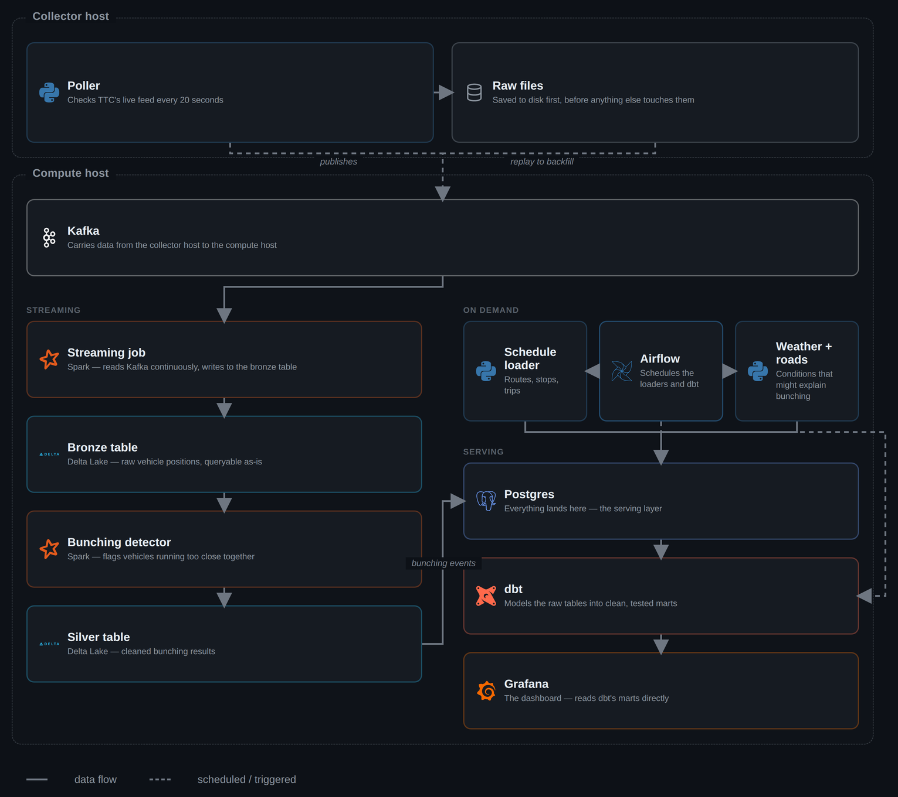

# Toronto Transit Reliability Platform

A lakehouse pipeline that watches TTC's live vehicle positions and answers a simple question: **where,
when, and why does service bunch up** — two buses or streetcars back-to-back on the same route, with a
long gap behind them.

It polls TTC's live GTFS-RT feed every 20 seconds, streams positions through Kafka into a Delta Lake
bronze/silver layer, runs a bunching heuristic in Spark, and serves the results through dbt-modeled
Postgres tables and a Grafana dashboard.

This is a learning project — built to get hands-on with Spark, Kafka, and Delta Lake, not to ship a
product. See [Why it's built this way](#why-its-built-this-way) for the reasoning behind each choice, and
[Notable bugs and fixes](#notable-bugs-and-fixes) for two real problems it caught along the way.

---

## Tech stack

<p align="center">
  
</p>

---

## Architecture

Raw files are the ground truth. Everything downstream — Kafka, Delta, Postgres, dbt's marts — is derived
from them and can be rebuilt from scratch if a bug is found in any transformation. That actually happened
during development; see [Notable bugs and fixes](#notable-bugs-and-fixes).

<p align="center">
  
</p>

This runs across two machines. An always-on **collector host** just runs the poller — it's the only piece
that needs to be up 24/7. A **compute host** (your PC, only on when you're using it) runs everything else.

**What each piece does, in order:**

1. **Poller** polls TTC's GTFS-RT feed every 20 seconds and saves the raw bytes to disk *before* decoding
   them — the raw archive is what makes every later stage replayable if a bug turns up downstream.
2. **Kafka** is the transport between the two hosts. The poller publishes to it live; a replay tool can
   also push the raw archive through it later, for backfills or testing.
3. A **Spark streaming job** consumes from Kafka continuously into a **Delta Lake bronze table** on
   **MinIO** — an S3-compatible store, so the same code would work against real S3 with a config change.
4. A **Spark batch job** re-scans bronze on a schedule and runs the **bunching detector** (two vehicles on
   the same route within one stop of each other), writing results into Delta silver and into **Postgres**.
5. Two on-demand loaders bring in **schedule data** (routes/stops/trips) and **weather + road-restriction**
   data, also landing in Postgres.
6. **dbt** builds staging views and gold-layer marts on top of Postgres — the tables **Grafana** actually
   reads from.
7. **Airflow** schedules the loaders and the dbt build, so the whole pipeline from bronze to dashboard
   refreshes on its own.

### Stack details

| Layer | Tech | Role |
|---|---|---|
| Ingestion | Python, `gtfs-realtime-bindings` | Polls TTC's live GTFS-RT feed every 20s, decodes protobuf → Parquet |
| Streaming | Apache Kafka 3.8 (KRaft) | Carries vehicle positions from the collector host to the compute host |
| Processing | Apache Spark 3.5.3 (Structured Streaming + batch) | Kafka → Delta bronze, plus the bunching heuristic |
| Storage format | Delta Lake 3.2.0 | ACID table format for the bronze/silver layers |
| Object storage | MinIO | S3-compatible storage backing the Delta tables |
| Database | PostgreSQL 16 | Serving layer — bunching events, routes, weather, road restrictions |
| Transformation | dbt (`dbt-postgres`) | Staging views + gold-layer marts, plus data tests |
| Orchestration | Apache Airflow 2.10.3 | Schedules the loaders and the dbt build |
| Visualization | Grafana 11.2.0 | Dashboard reading straight off dbt's gold marts |
| Dev tooling | JupyterLab, pgAdmin, AKHQ | Poking at Spark/Postgres/Kafka during development |
| Infra | Docker Compose, two hosts | Everything above runs as containers |
| Testing | pytest, dbt tests | Per-subproject unit tests + data-quality tests on the gold layer |

---

## Dashboard: what it found

Across ~8.7 days of real TTC vehicle-position data (2026-08-12 to 2026-08-21, ~51.8M raw position
reports), the bunching detector flagged **8,283,684 events across 213 of TTC's 233 routes — 91.4% of the
network affected at least once**. Streetcar routes dominate the top of the list despite being a small
fraction of the network:

| Route | Name | Bunching events |
|:-----:|------|-----------------:|
| 504 | King | 374,410 |
| 506 | Carlton | 279,540 |
| 52 | Lawrence West | 242,472 |
| 939 | Finch Express | 234,839 |
| 505 | Dundas | 201,633 |

504 King and 506 Carlton alone account for more flagged events than the next four routes combined. Both
run in mixed traffic on some of the busiest streetcar rights-of-way in the city, which matches their real
reputation for bunching. The full per-route breakdown (all 213 routes) is exported at
[`docs/bunching_by_route_8day_backfill.csv`](docs/bunching_by_route_8day_backfill.csv), and the full
methodology and its limitations are in `docs/architecture.md`. The biggest caveat: GTFS-RT's
`direction_id` field is 100% null in TTC's feed, so the detector can't yet fully distinguish two vehicles
bunched together from two passing each other going opposite ways — see
[Known limitations](#known-limitations).

<p align="center">
  
</p>
<p align="center"><sub>Grafana, reading directly off dbt's gold-layer marts. No custom frontend.</sub></p>

---

## Getting started

### 1. Collector host — run the poller

```bash
git clone <this-repo>
cd ttc-platform
make poller-up
make poller-logs        # watch it start pulling data; Ctrl+C to stop watching (poller keeps running)
```

Check on it any time, or stop it — data already on disk is untouched either way:

```bash
make poller-status
make poller-down
```

### 2. Compute host — run everything else

```bash
make on           # start Kafka, MinIO, Postgres, Spark, Jupyter, Airflow, pgAdmin, Grafana
make infra-status # service URLs + credentials
make off           # stop everything before shutting the machine down; no data is lost
```

`make on`/`make off` are short names for `infra-up`/`infra-down`, handy for an overnight routine if you
don't want the compute host running 24/7. The collector host is the only piece that needs to be.

### 3. Everything else, on demand via `make`

| Command | What it does | Phase |
|---|---|:--:|
| `make gtfs-load` | Load routes/stops/trips from TTC's static GTFS feed | 3 |
| `make weather-load` | Current Toronto conditions | 6 |
| `make restrictions-load` | Road restrictions + spatial join against stops | 6 |
| `make replay-asap` | Republish collected raw files into Kafka, for testing/backfill | 2 |
| `make dbt-build` | Build the staging views + gold marts, run all dbt tests | 8 |
| `make dbt-test` | Just the tests, faster when models haven't changed | 8 |
| `make dbt-docs` | dbt's auto-generated docs site → `http://localhost:8087` | 8 |

All three loaders also have an Airflow DAG that runs them on a schedule instead, paused by default —
unpause via the UI at `:8090` or `airflow dags unpause <dag_id>`.

Grafana is at `http://localhost:3000` (`admin`/`admin`) once `make on` has run and `make dbt-build` has
populated the gold layer at least once.

### Running the tests

Each Python subproject has its own tests, run inside its own Docker image so dependencies match exactly
what production uses — no network needed, works anywhere:

```bash
make test   # poller + replay tests
```

The same pattern applies to `gtfs_static/`, `context_data/`, and their tests under `tests/`: build that
subproject's image and run pytest inside it.

### What's on disk after a night of collection

```
data/
├── raw/vehicle_positions/date=YYYY-MM-DD/hour=HH/*.pb.gz     <- ground truth
└── bronze/vehicle_positions/date=YYYY-MM-DD/hour=HH/*.parquet <- decoded, queryable
```

Plus, once the compute host's stack has run: a Delta table on MinIO fed by Kafka in real time, a
dimensional model and bunching/weather/restriction tables in Postgres, dbt's gold-layer marts on top of
those, a Grafana dashboard reading the marts, and Airflow DAGs ready to keep all of it fresh on a
schedule.

---

## Notable bugs and fixes

**Vehicles matched against themselves.** Early Grafana runs showed 44% of "bunching events" as a vehicle
matched against itself, which is impossible and a clear sign something was wrong upstream, not a modeling
quirk. The cause was ~2.9M duplicate rows in bronze from a Kafka crash-loop during a backlog replay — a
batch that was read but never cleanly checkpointed before Kafka went down got reprocessed on restart. The
fix dedupes bronze before the bunching window function runs, plus a dbt test (`assert_no_self_bunching`)
so a regression fails the build loudly instead of silently shipping bad numbers again. Full writeup,
including a second bug this surfaced (a Postgres `DROP TABLE` conflict with a dbt view depending on the
same table), is in `docs/architecture.md`.

**Silent message drops during a bulk replay.** Backfilling 8 days of collector downtime turned up a
second one. `make replay-asap` republishes every archived raw file into Kafka back-to-back with no
pacing, and `producer.produce()` doesn't block: it raises `BufferError` once librdkafka's local outbound
queue (100k messages) fills faster than the network can drain it. The original code caught that exception
in a catch-all handler and moved on, which meant a bulk replay over a slow link would quietly drop most of
its rows instead of publishing them — the logs showed a wall of `Kafka publish failed: Local: Queue full`
and it would have finished having dropped the majority of ~51M rows. The fix retries `produce()` on
`BufferError`, calling `producer.poll(0.5)` to drain in-flight deliveries and free queue space before
trying again. Same function is used by both the live poller and the replay tool, so this makes both
robust without changing normal low-volume behavior. With the fix, the full backfill (37,573 files, 51.36M
rows) replayed with zero dropped messages.

---

## Why it's built this way

- **Raw bytes saved before decoding.** GTFS-RT publishes no history — this minute's data is gone forever
  once TTC's server moves on. If decode logic ever has a bug, the fix gets applied and the raw files get
  replayed to regenerate correct output.
- **Batched flush, not one file per poll.** Avoids the classic small-files performance problem.
- **Explicit schemas everywhere,** not "infer it later." Parquet, Kafka JSON, and the Postgres
  dimensional model all declare their shape up front.
- **Raw is the source of truth; everything else is derived and replayable.** Kafka, Delta, the Postgres
  tables, and dbt's marts can all be rebuilt from the raw archive if something downstream needs fixing.
- **The right tool for the data size, not the most impressive one.** GTFS static, weather, and road
  restrictions are all small enough for plain Python; Spark is reserved for the live position stream and
  the bunching detector, which actually need it. dbt does the final SQL reshaping in Postgres rather than
  pulling everything back into Spark, since the gold layer only needs what's already there.
- **Grafana on the gold layer instead of a custom frontend.** This is a data engineering project, not a
  product. Pointing an existing BI tool at well-modeled tables answers the "why was this bus bunched"
  question without building and maintaining a bespoke app.

---

## Known limitations

- **No direction-of-travel in the live feed.** GTFS-RT's `direction_id` field is 100% null in TTC's feed,
  and the live feed's `trip_id`s don't reliably match a static-schedule download from a different publish.
  The bunching detector can't yet fully distinguish two vehicles bunched together from two passing each
  other going opposite ways. See Phase 5 in `docs/architecture.md` for the numbers behind this and what
  was tried.
- **No road-restriction context on individual bunching events,** even though `road_restrictions` and a
  precomputed stop/restriction spatial join both exist in Postgres. `bunching_events` doesn't carry a stop
  location to join against yet — fixing this means capturing stop location at detection time in
  `notebooks/02_silver_bunching.py`.
- **Weather correlation is a capability, not a finding yet.** The pipeline can join bunching events
  against the closest-in-time weather observation, but the weather loader has only been run a couple of
  times manually so far — there isn't enough weather variety in the data to draw a real conclusion about
  weather's effect on bunching. Running `weather-load` on a schedule (its Airflow DAG exists, unpause it)
  over more days would make this a real analysis instead of a plumbing demo.

---

## Roadmap

| Phase | Description | Status |
|:--:|---|:--:|
| 1 | Raw + bronze Parquet collection | done |
| 2 | Kafka (real-time layer) + replay mode | done |
| 3 | GTFS static → dimensional model + SCD2 | done |
| 4 | Spark Structured Streaming → Delta Lake | done |
| 5 | Silver layer, bunching detector | done |
| 6 | Road restrictions (spatial join) + weather | done |
| 7 | Airflow orchestration | done |
| 8 | dbt gold layer + tests | done |
| 9a | Grafana dashboard on the gold layer | done |
| 9b | CI, decisions doc, packaging | not started |
