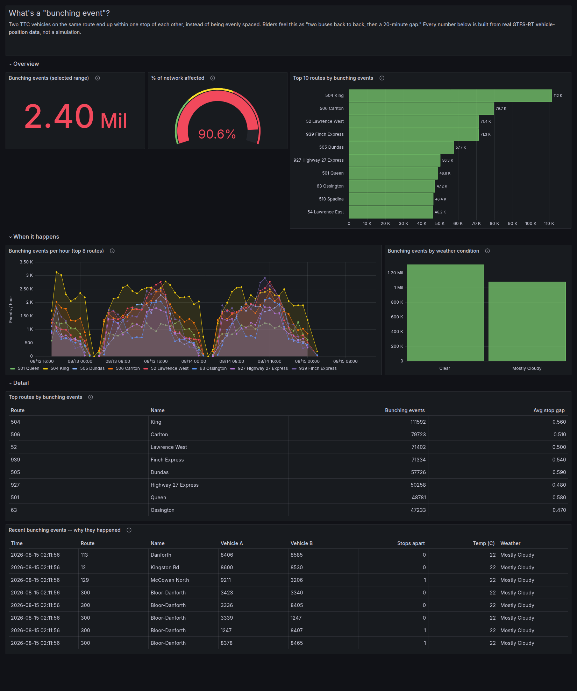
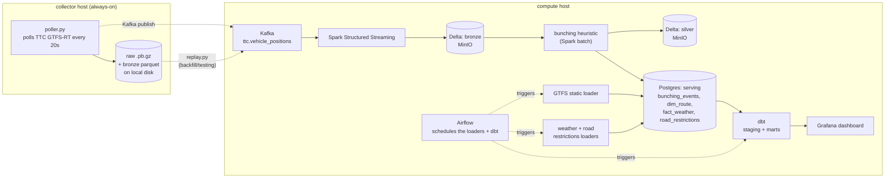

# Toronto Transit Reliability Platform

A learning project: a lakehouse pipeline that ingests real TTC realtime vehicle positions, plus static
schedules, road restrictions, and weather, to answer *where, when, and why TTC surface service is
unreliable.*

Status: **Phases 1–9a built and verified end to end** — live ingestion, Kafka, Structured Streaming to
Delta, a dimensional model, a bunching heuristic, weather/road-restriction context data, Airflow
orchestration, a dbt gold layer, and a Grafana dashboard on top of it.

## What it found

Across ~2.4 days of real TTC vehicle-position data (2026-08-12 to 2026-08-15, ~14M raw position reports),
the bunching heuristic (Phase 5 — two vehicles on the same route within one stop of each other) flagged
**2,398,668 events across 211 of TTC's 233 routes**. Streetcar routes dominate the top of the list despite
being a small fraction of the network:

| Route | Name | Bunching events |
|---|---|---|
| 504 | King | 111,592 |
| 506 | Carlton | 79,723 |
| 52 | Lawrence West | 71,402 |
| 939 | Finch Express | 71,334 |
| 505 | Dundas | 57,726 |

504 King and 506 Carlton alone account for more flagged events than the next four routes combined — both
run in mixed traffic on some of the busiest streetcar rights-of-way in the city, which matches their real
reputation for bunching. See `docs/architecture.md` for the full methodology and its limitations (notably:
no direction-of-travel data in the live feed, so this can't yet distinguish "two streetcars bunched
together" from "two streetcars passing each other going opposite ways" with full precision).



## How data moves through it



Raw files are the ground truth — everything else (Kafka, Delta, Postgres, dbt's marts) is derived and
replayable from them. If a bug is found in any transformation downstream, the fix gets applied and the
raw archive gets replayed to regenerate correct output — this actually happened during development (see
"A real bug" below).

## A real bug this project caught (and how it was found)

Early Grafana dashboard runs showed 44% of "bunching events" as a vehicle matched against itself —
impossible, and a clear sign something was wrong upstream, not a modeling quirk. Traced to ~2.9M
duplicate rows in bronze from a Kafka crash-loop during a backlog replay: a batch that was read but not
cleanly checkpointed before Kafka went down got reprocessed on restart. Fixed by deduplicating bronze
before the bunching window function runs, with a defensive filter and a dbt test
(`assert_no_self_bunching`) so a regression fails the build loudly instead of silently shipping bad
numbers again. Full writeup, including a second bug this surfaced (a Postgres `DROP TABLE` conflict with
a dbt view depending on the same table), is in `docs/architecture.md`.

This runs across two machines:

- **collector host** — an always-on machine that just runs the poller (`compose.poller.yml`)
- **compute host** — your PC, running everything else (`compose.infra.yml`): Kafka, MinIO, Postgres,
  Spark, Jupyter, Airflow, dbt, Grafana

## Quickstart

### On the collector host: run the poller

```bash
git clone <this-repo>
cd ttc-platform
make poller-up
make poller-logs        # watch it start pulling data; Ctrl+C to stop watching (poller keeps running)
```

Check on it any time, or stop it (data already on disk is untouched either way):
```bash
make poller-status
make poller-down
```

### On the compute host: run everything else

```bash
make on           # start Kafka, MinIO, Postgres, Spark, Jupyter, Airflow, pgAdmin, Grafana
make infra-status # service URLs + credentials
make off           # stop everything before shutting the machine down; no data is lost
```

`make on`/`make off` are just short names for `infra-up`/`infra-down` — handy for an overnight routine
if you don't want the compute host running 24/7 (the collector host is the only piece that needs to be).

### Everything else is on-demand, via `make`

```bash
make gtfs-load           # load routes/stops/trips from TTC's static GTFS feed (Phase 3)
make weather-load        # current Toronto conditions (Phase 6)
make restrictions-load   # road restrictions + spatial join against stops (Phase 6)
make replay-asap          # republish collected raw files into Kafka, for testing/backfill (Phase 2)
make dbt-build            # build the staging views + gold marts, run all dbt tests (Phase 8)
make dbt-test              # just the tests, faster when models haven't changed
make dbt-docs               # dbt's auto-generated docs site, http://localhost:8087
```

All three loaders also have an Airflow DAG that runs them on a schedule instead — paused by default
(unpause via the UI at `:8090` or `airflow dags unpause <dag_id>`).

Grafana is at `http://localhost:3000` (`admin`/`admin`) once `make on` has run and `make dbt-build` has
populated the gold layer at least once.

## Run the tests (no network needed, works anywhere)

Each Python subproject has its own tests, run inside its own Docker image so dependencies match exactly
what production uses:

```bash
make test   # poller + replay tests
```

The same pattern applies to `gtfs_static/`, `context_data/`, and their tests under `tests/` — build that
subproject's image and run pytest inside it.

## What's on disk after a night of collection

```
data/
├── raw/vehicle_positions/date=YYYY-MM-DD/hour=HH/*.pb.gz     <- ground truth
└── bronze/vehicle_positions/date=YYYY-MM-DD/hour=HH/*.parquet <- decoded, queryable
```

Plus, once the compute host's stack has run: a Delta table on MinIO fed by Kafka in real time, a
dimensional model and bunching/weather/restriction tables in Postgres, dbt's gold-layer marts on top of
those, a Grafana dashboard reading the marts, and Airflow DAGs ready to keep all of it fresh on a
schedule.

## Why it's built this way

- **Raw bytes saved before decoding.** GTFS-RT publishes no history — this minute's data is gone
  forever once TTC's server moves on. If decode logic ever has a bug, the fix gets applied and the raw
  files get replayed to regenerate correct output.
- **Batched flush, not one file per poll.** Avoids the classic small-files performance problem.
- **Explicit schemas everywhere**, not "infer it later" — Parquet, Kafka JSON, and the Postgres
  dimensional model all declare their shape up front.
- **Raw is the source of truth, everything else is derived and replayable** — Kafka, Delta, the
  Postgres tables, and dbt's marts can all be rebuilt from the raw archive if something downstream needs
  fixing.
- **Use the right tool for the data size**, not the most impressive one — GTFS static, weather, and
  road restrictions are all small enough for plain Python; Spark is reserved for the live position
  stream and the bunching analysis, which actually need it. dbt does the final SQL reshaping in Postgres
  rather than pulling everything back into Spark, since the gold layer only needs what's already there.
- **Grafana on the gold layer instead of a custom frontend** — this is a data engineering project, not
  a product. Pointing an existing BI tool at well-modeled tables answers the "why was this bus bunched"
  question without building and maintaining a bespoke app.

## Known limitations

- **No direction-of-travel in the live feed.** GTFS-RT's `direction_id` field is 100% null in TTC's
  feed, and the live feed's `trip_id`s don't reliably match a static-schedule download from a different
  publish. The bunching heuristic can't yet fully distinguish two vehicles bunched together from two
  passing each other going opposite ways. See Phase 5 in `docs/architecture.md` for the numbers behind
  this and what was tried.
- **No road-restriction context on individual bunching events**, even though `road_restrictions` and a
  precomputed stop/restriction spatial join both exist in Postgres — `bunching_events` doesn't carry a
  stop location to join against yet. Fixing this means capturing stop location at detection time in
  `notebooks/02_silver_bunching.py`.
- **Weather correlation is a capability, not a finding yet.** The pipeline can join bunching events
  against the closest-in-time weather observation, but the weather loader has only been run a couple of
  times manually so far — there isn't enough weather variety in the data yet to draw a real conclusion
  about weather's effect on bunching. Running `weather-load` on a schedule (its Airflow DAG exists,
  unpause it) over more days would make this a real analysis instead of a plumbing demo.

## Roadmap

- [x] Phase 1: raw + bronze Parquet collection
- [x] Phase 2: Kafka (real-time layer) + replay mode
- [x] Phase 3: GTFS static → dimensional model + SCD2
- [x] Phase 4: Spark Structured Streaming → Delta Lake
- [x] Phase 5: silver layer, bunching heuristic
- [x] Phase 6: road restrictions (spatial join) + weather
- [x] Phase 7: Airflow orchestration
- [x] Phase 8: dbt gold layer + tests
- [x] Phase 9a: Grafana dashboard on the gold layer
- [ ] Phase 9b: CI, decisions doc, packaging
